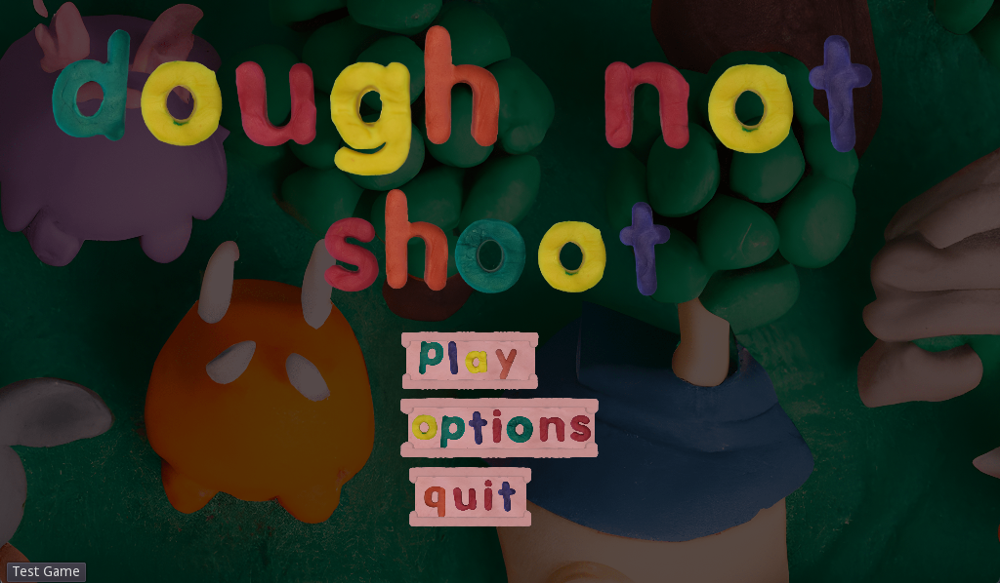
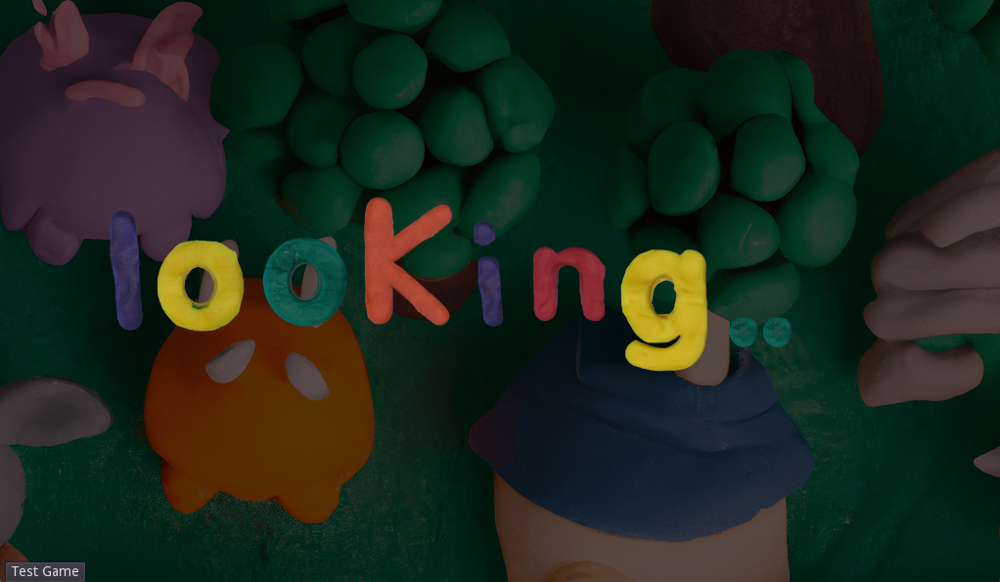
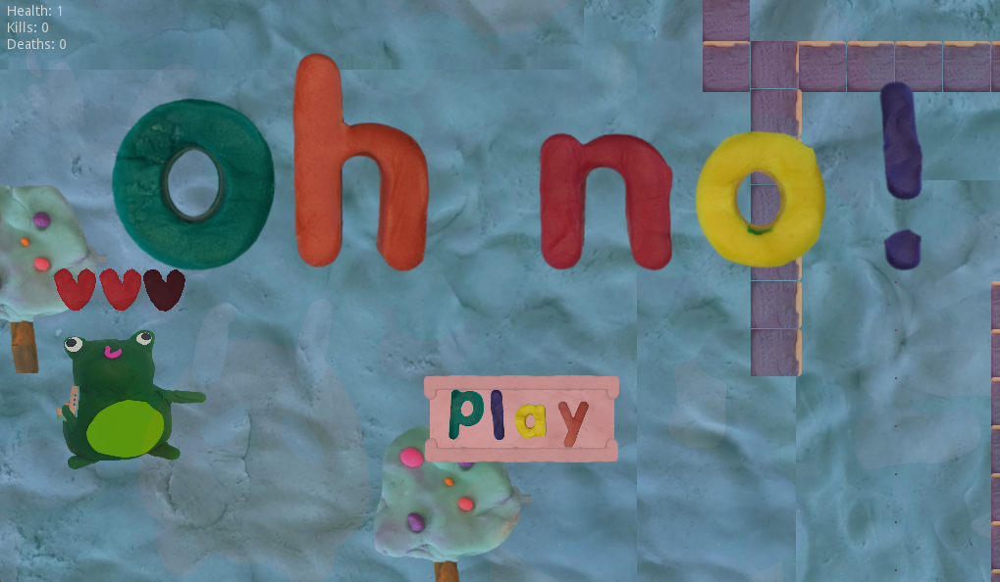
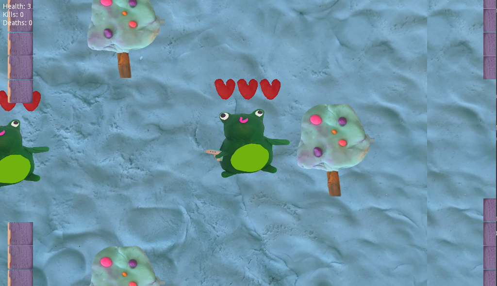
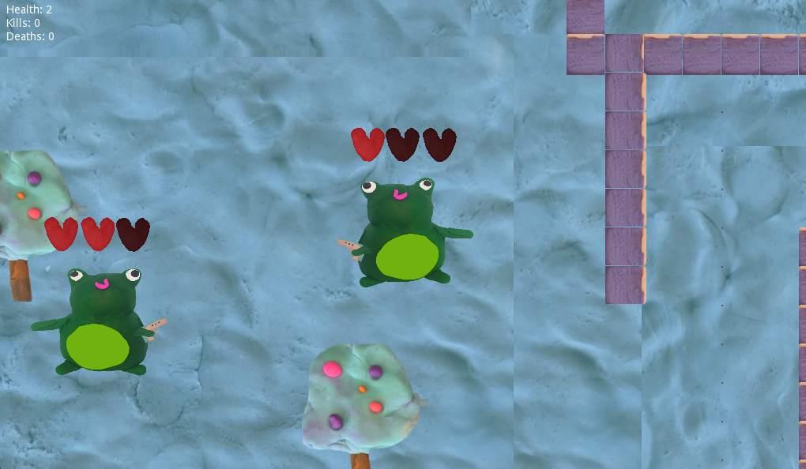

# Dough Not Shoot - A Multiplayer Game!

Dough Not Shoot is a friendly multiplayer game. All the assets were hand crafted from playdough, keyed, then mapped into the game. It was was built for the 2 day 2022 UQCS Hackathon and ended up winning the [Best Design Award.](https://uqcs.org/showcase/). The game can be played [here](https://drawde96.itch.io/dough-not-shoot), then by clicking test game.

### The Game

Dough Not Shoot is built in the game engine Godot, written primarily in its native language GDSscript. While Dough Not Shoot main defining characteristic is it assets, another key feature is the netcode and dedicated server! It has interpolation and extrapolation features, along with client checks to ensure no cheating (although simple)!

#### Menus

Features a main menu, queue menu, and respawn screen.

  
   
  

#### Gameplay

Each player controls a 'frog', equiped with a gun and a health bar. There is no objective to the the game, and shooting is not required, although possible! The map features pristine trees, thick walls and bad respawn positions. 

  
   

#### The Dedicated Server

Clients communicate through a dedicated server via a delpoyment in AWS EC2 (no longer available, load balancing costs too much). It is possible to also run the server locally.

## Installation

If you would like to play the game through a browser please see here, [here](https://drawde96.itch.io/dough-not-shoot). Alternatively, if you wish to run the game or server locally:

1) Install Godot Game Engine

For the Game:

2) Clone repo (sounds branch)
3) Open client folder in Godot
4) Project -> Export -> (Platform of Choice)

For The Server:

5) Clone repo (sounds branch)
6) Open server folder in Godot
7) Project -> Export -> (Platform of Choice)

Note: If you wish to connect to the server locally, update the var ip in client/singletons/server.gd to be your local IP address.

### Acknowledgments

Huge shoutout to UQ Computing Society and the commitee for making the best Hackathon at UQ yet. Shoutout to the sponsors for keeping the price pool big. Of course thanks to the team: Edward, Krystyna and James  for coming together, building something fun and learning game development in general (No one on the team had experience with game development at all)! Also HUGE shout out to the all famous Levi for making us some audio assets.
